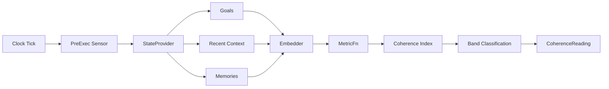

# Core Concepts

## Architecture Overview



The sensor pipeline runs on every clock tick:

1. **StateProvider** gathers the agent's current goals, context, and memories
2. **Embedder** converts text into vectors
3. **MetricFn[]** compute metrics from the embeddings (strategy pattern)
4. **Coherence index** is computed as a weighted sum of all metrics
5. **Band classification** maps the index to green/yellow/orange/red

## Interoception

Interoception means "internal sensing" — the ability to sense one's own internal state. In biology, it's how your body knows it's hungry, tired, or stressed.

For AI agents, interoception answers: **"Am I thinking straight right now?"**

The sensor measures four dimensions of coherence before the agent acts (pre-execution), giving you a chance to pause, re-plan, or alert when the agent is drifting.

## Embedder

```typescript
interface Embedder {
  embed(text: string): Promise<number[]>;
  embedBatch(texts: string[]): Promise<number[][]>;
  readonly dimensions: number;
}
```

The embedder is pluggable — you bring your own implementation. It converts text into vectors that the metrics use to measure similarity, drift, and diffusion. The sensor deduplicates texts before calling `embedBatch` for efficiency.

## StateProvider

```typescript
interface StateProvider {
  getGoals(): Promise<string[]>;
  getRecentContext(): Promise<string[]>;
  getGoalRelevantMemories(): Promise<string[]>;
  getAllMemories(): Promise<string[]>;
}
```

The state provider is the bridge between your agent's internals and the sensor. All four methods return arrays of strings — the sensor handles embedding and metric computation from there.

## MetricFn

```typescript
interface MetricFn {
  name: string;
  compute(input: MetricInput): number;
}
```

Metrics follow the strategy pattern. Each has a name (used as the key in `MetricSnapshot`) and a `compute` function that returns a value in [0, 1].

**Polarity**: Some metrics are "inverted" — higher values mean _less_ coherent. Goal drift is inverted (1 = drifted = bad), while memory retention is not (1 = retained = good). The `computeCoherenceIndex` function handles this internally, flipping inverted metrics so the final index always means "higher = more coherent".

## CoherenceReading

```typescript
interface CoherenceReading {
  ts: number;
  tickSeq: number;
  metrics: MetricSnapshot;
  coherenceIndex: number;
  band: Band;
}
```

The output of every sensor measurement. Contains all metric values, the weighted coherence index (0 = incoherent, 1 = coherent), and the band classification.

## How They Fit Together

A clock ticks → the sensor calls your StateProvider to gather goals, context, and memories → passes everything through the Embedder → runs each MetricFn against the embeddings → computes a weighted coherence index → classifies into a band → returns a `CoherenceReading`.

The sensor stores readings in a ring buffer (default 100), accessible via `sensor.history()`. The consumer decides what to do with the reading — pause, re-plan, log, alert, or continue.

## Design Philosophy

- **Pure measurement** — the sensor has no side effects on the signal bus or agent behavior
- **Pluggable everything** — Embedder, StateProvider, and MetricFn are all consumer-provided
- **Noop-safe** — empty inputs produce 0, not errors
- **Strategy pattern** — swap, add, or remove metrics without changing the sensor
